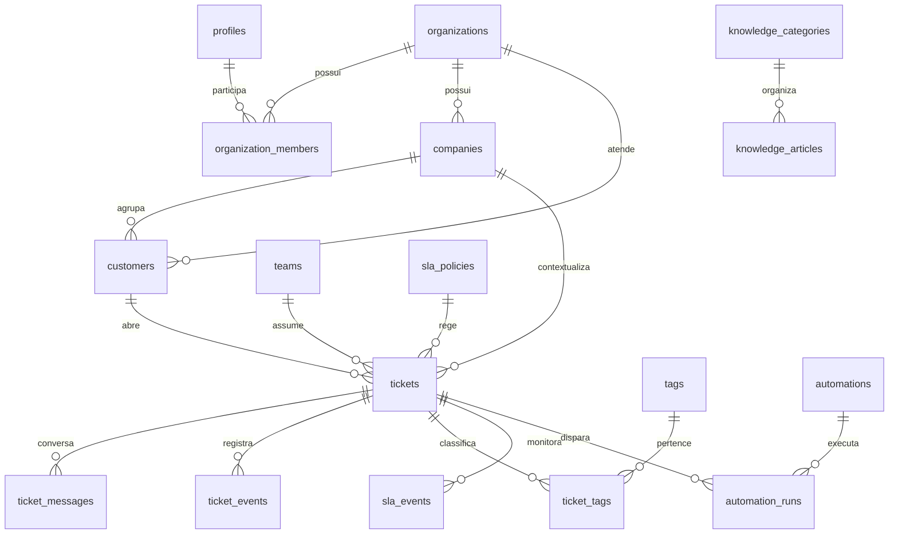

# Modelo de dados

## Relacionamentos

## Entidades

- Identidade: `profiles`, `organizations`, `organization_members`, `teams`.
- Atendimento: `companies`, `customers`, `tickets`, `ticket_messages`, `ticket_events`, `ticket_assignees`, `tags`, `ticket_tags`, `attachments`.
- Operação: `sla_policies`, `sla_events`, `automations`, `automation_runs`, `canned_responses`, `notifications`, `audit_logs`.
- Autoatendimento: `knowledge_categories`, `knowledge_articles`, `customer_feedback`.
- Assistência: `ai_suggestions`.

Todo dado de negócio tem `organization_id`. Relações entre dados de negócio usam FKs compostas por `organization_id` e id, bloqueando referências cruzadas entre empresas. O número de ticket é único dentro da organização. As tabelas de conversa e evento usam índice de timeline; tickets usam índices de fila, cliente e responsável. Busca textual usa `to_tsvector` com GIN. O idioma do índice deverá acompanhar os idiomas efetivos dos clientes após a fase de busca.

## RLS

RLS está ativo em todas as tabelas públicas. Funções `is_member`, `has_role` e `owns_customer` resolvem pertença usando `auth.uid()` sem recursão de políticas. Staff lê tickets da sua organização. Clientes leem somente tickets vinculados ao seu registro e mensagens `public`; notas internas têm visibilidade `internal`. Tabelas de eventos, SLA e auditoria têm escrita reservada ao serviço de domínio futuro. A criação da organização usa uma RPC validada e autenticada.

Antes de publicar em produção, testar as políticas contra dois tenants reais e todos os cinco papéis, incluindo leitura de mensagens internas, troca de `organization_id`, elevação de papel e acesso a anexos. Regras do bucket de Storage precisam acompanhar a visibilidade da mensagem.

## Consultas principais

- Fila: `organization_id + status + priority`, ordenada por `updated_at`.
- Ticket: `organization_id + id`, mensagens e eventos ordenados por `created_at`.
- Cliente: `organization_id + customer_id`, tickets por data.
- Notificações: `organization_id + recipient_id` com `read_at is null`.
- Pesquisa: GIN full text sobre título/corpo de artigos e assunto/descrição de tickets.

Migração inicial: [`supabase/migrations/0001_initial.sql`](../supabase/migrations/0001_initial.sql).
